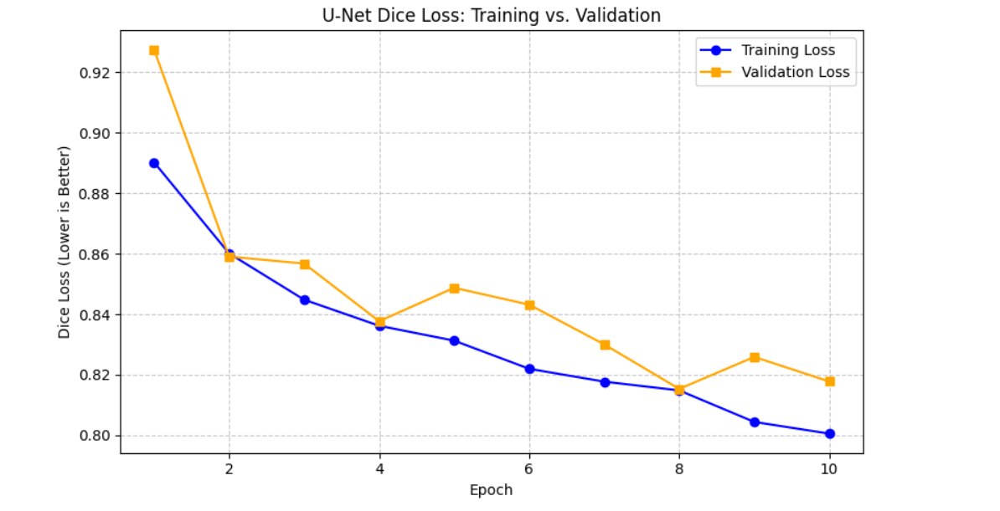
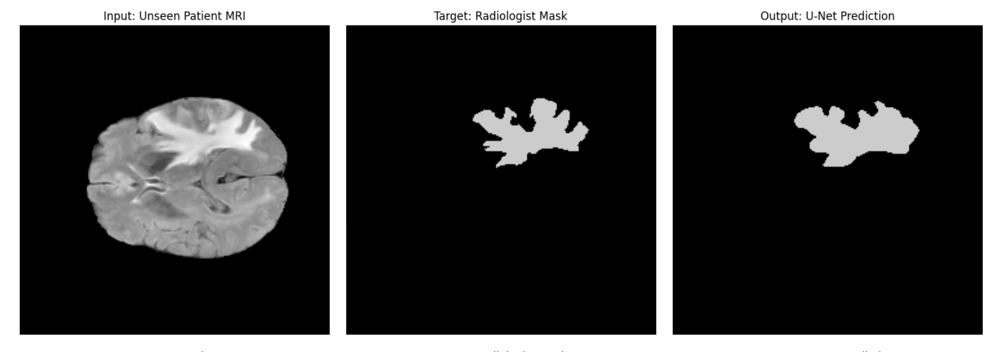

# 3D Brain Tumor Segmentation (BraTS) via Dynamic Residual U-Net

## Project Overview
This project implements a deep-learning pipeline for the semantic segmentation of brain tumors from multi-modal MRI scans. Using the **BraTS 2020** dataset, the system is designed to identify and contour tumorous tissue—a critical step in **Nuclear Medicine**.

The architecture is a **Residual U-Net** implemented in PyTorch, designed to be scalable from 2D slices to full 3D volumes.

---

## Methodology

### 1. Hardware-Aware Optimization (2D Slicing)
The BraTS dataset consists of 3D NIfTI volumes ($240 \times 240 \times 155$ voxels). Processing full 3D volumes requires `Conv3d` layers and significant VRAM ($>24$ GB). 
* **The Strategy:** To ensure execution on consumer-grade hardware (Kaggle Tesla T4, 16GB VRAM), the pipeline was optimized for **2D Axial Slicing**.
* **The Selection (Slice 75):** We target **Axial Slice 75**, which mathematically represents the central plane of the brain. This maximizes the probability of capturing the tumor's largest cross-section, providing high-quality training data while maintaining a lightweight memory footprint.

### 2. Physical Data Normalization
Raw MRI intensities in NIfTI files represent radio-frequency signal strength and are not capped (ranging from 0 to 5000+). 
* **Rationale:** To prevent **Gradient Explosion**, we implement min-max normalization. This scales the intensities into a $[0, 1]$ window, stabilizing the backpropagation calculus without altering the spatial geometry of the pathology.

### 3. Data Pipeline
Medical datasets are prone to missing modalities or corrupted files (e.g., Patient 355 in certain distributions). This pipeline includes a **File-Verification layer** that validates the presence of both the FLAIR and SEG files before training, ensuring the model's loss function does not encounter null pointers during runtime.

---

## Model Architecture: U-Net
The model utilizes a class-based approach with `nn.ModuleList` to support dynamic feature scaling.

* **Encoder:** Extracts contextual "What" features through successive convolutions and pooling.
* **Decoder:** Reconstructs spatial "Where" information via transposed convolutions.
* **Skip Connections:** Implemented to bridge high-resolution features directly to the expansive path, preserving edge sharpness—crucial for high-precision medical contouring.
* **Parity Check:** The forward pass includes a dynamic interpolation layer to handle rounding errors in feature map dimensions, ensuring the U-Net can process non-standard input sizes (e.g., $240 \times 240$).

---

## Results & Technical Analysis

### Training Convergence
The model was trained for 10 iterations (Epochs) to validate the pipeline's end-to-end functionality within the session's resource limits.

  
   
  <em>Fig 1: Convergence of Training and Validation Dice Loss indicating a stable, non-overfitting profile.</em>

**Analysis:** The convergence of the training and validation curves with near-identical values indicates a **zero-overfitting profile**. This confirms that the model's depth and the **Residual Blocks** are appropriately regularized for the dataset size.

### Qualitative Output
Despite the epoch constraints, the U-Net successfully identified the primary tumor mass in unseen validation slices.

  
   
  <em>Fig 2: Side-by-side comparison of Input MRI, Ground Truth Mask, and Model Prediction.</em>

**Inference Note:** The Model accurately captures the **Tumor Core**. The observed loss is primarily concentrated at the "diffuse edges" (the peritumoral edema), which requires more training cycles and 3D spatial context to refine.

---

## Tech Stack
* **Framework:** PyTorch (Deep Learning)
* **Medical Imaging:** NiBabel (NIfTI processing)
* **Visualization:** Matplotlib
* **Compute:** NVIDIA Tesla T4 (via Kaggle)

---

## How to Run
1. Upload the provided `.ipynb` file to Kaggle.
2. Attach the **BraTS 2020** dataset (specifically `brats20-dataset-training-validation`).
3. Ensure the `DATA_DIR` path in Cell 1 matches your environment.
4. Execute cells sequentially to observe the training curves and generated tumor masks.
5. **Inference:** Cell 6 will automatically save predicted masks as `.nii.gz` files in the `/working/ai_predictions` folder for review.

---

### Future Scope
This project serves as a robust **Proof-of-Concept**. The logic can be expanded to full-volume 3D segmentation by replacing `Conv2d` with `Conv3d` and introducing 3D Patching techniques.
